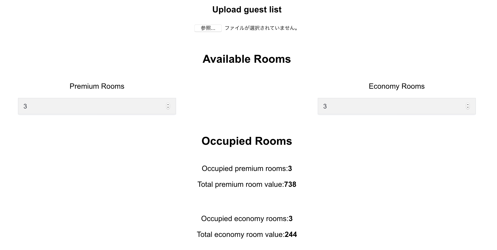

# Occupancy Optimization

Prioritize guests paying over a threshold while maximizing obtained value.

## Getting Started

These instructions will get a copy of this project up and running

### Installation

In the project directory, run:
`yarn start`

This will install dependencies and start the development server.

### Running tests

In the project directory, run:
`yarn test`

## Built With
This project was bootstrapped with [Create React App](https://github.com/facebook/create-react-app).
